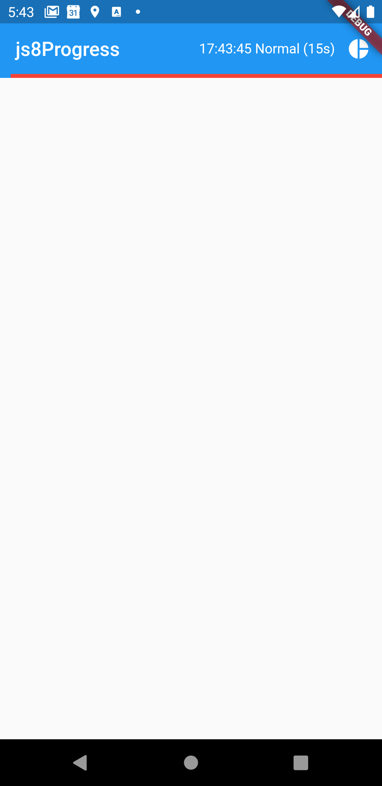
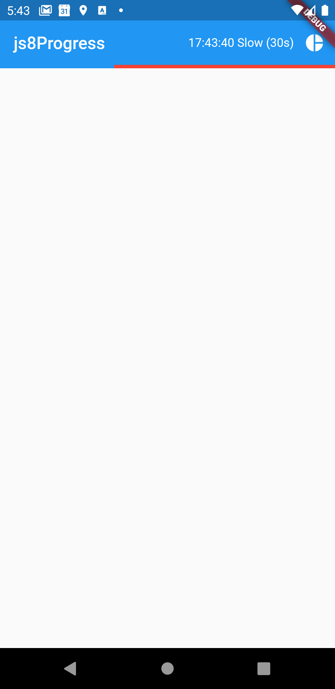

# js8progressindicator

Widget with sample Flutter app. Progress indicator for current TX period on JS8Call.

Tap on the icon to toggle between modes.

Modes: 

- Slow
- Normal
- Fast
- Turbo

Screenshot in Normal mode: 

Screenshot in Slow mode:

